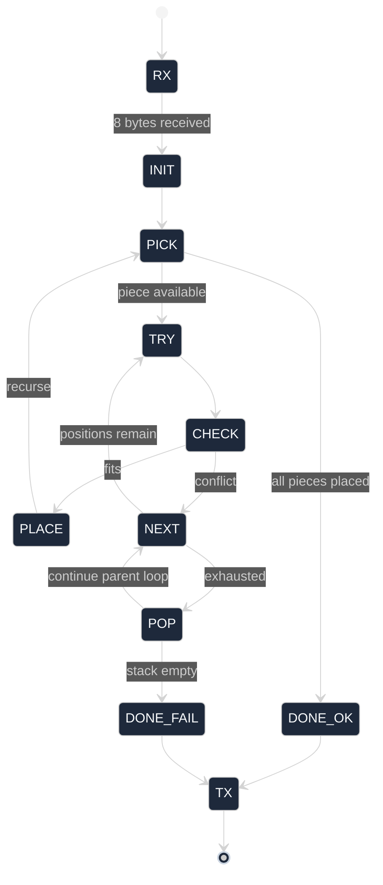
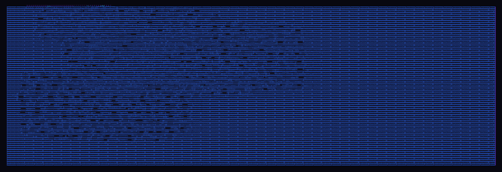

# Day 12 Range Finder — Backend Notes

Physical-design and sign-off study built on `tt_um_range_finder`, a Tiny
Tapeout (Sky130A) submission that solves Advent of Code 2025 Day 12 (2-D
gift packing via DFS backtracking).

The RTL (`src/project.v`, `tt_um_range_finder` / `Day_12_solver`) is by
Robert Solomon Saab (Discord `.djharvey`). The Verilog is left untouched.
What this repo adds is:

- a Python reference (`day12_golden_model.py`) that mirrors the AXI byte
  protocol and runs the same DFS,
- a small scraper (`extract_ppa.py`) that turns OpenLane's `metrics.json`
  into a markdown PPA table,
- notes on the RTL → GDSII flow and the HW/SW equivalence argument.

## Algorithm

Eight bytes in over an AXI-Stream-like channel:

```
byte[0] = W            ; grid width
byte[1] = H            ; grid height
byte[2..7] = c0..c5    ; how many of gift shape #0..#5 to pack
```

One byte back: `1` if solvable, `0` otherwise.

The hardware flattens the recursion stack into an FSM. The Python model
runs the same algorithm as a plain recursive function. The two are
I/O-equivalent.



## HW vs SW

| Aspect    | Hardware (`Day_12_solver`)   | Software (`day12_golden_model.py`) |
|-----------|------------------------------|------------------------------------|
| Algorithm | FSM-emulated DFS             | Python recursion                   |
| State     | On-chip grid + piece pointer | 2-D list + recursion stack         |
| Input     | 8-byte AXI-Stream            | `parse_axi_stream([W,H,c0..c5])`   |
| Output    | one byte on `m_tdata`        | `solve()` returns `0` / `1`        |

```
python day12_golden_model.py
```

dumps the AXI byte sequence and expected DUT byte for every regression
case. Diff that against the cocotb logs in `test/`.

## Sign-off Numbers

Sky130A, OpenLane, 10 MHz target. Pulled from
`runs/wokwi/final/metrics.json` by `extract_ppa.py`; long version is in
[`ppa_report.md`](ppa_report.md).

| Class    | Metric                              | Value               |
|----------|-------------------------------------|---------------------|
| Area     | Die / Core                          | 154113 / 149183 µm² |
| Area     | Std-cell area                       | 41906 µm²           |
| Area     | Core utilization                    | 28.09 %             |
| Cells    | Total / FF / comb                   | 5896 / 658 / 2106   |
| Cells    | Hold-fix / CTS buf / inv            | 508 / 46 / 25       |
| Cells    | Antenna diodes                      | 21                  |
| Routing  | Final wirelength                    | 114152 µm           |
| Routing  | Nets / vias                         | 3705 / 28233        |
| Routing  | DRC errors                          | 0                   |
| Timing   | Setup WS @ TT 25 °C 1.80 V          | +11.23 ns           |
| Timing   | Hold  WS @ TT 25 °C 1.80 V          | +0.32 ns            |
| Timing   | Setup WS @ SS 100 °C 1.60 V         | +2.33 ns            |
| Power    | Total @ TT 25 °C                    | 2.60 mW             |
| Sign-off | Magic DRC / Netgen LVS              | PASS / PASS         |

All TT/SS/FF corners close with zero setup/hold violations after CTS and
post-route timing repair.

## Layout

KLayout streamout of the final GDS
(`runs/wokwi/final/klayout_gds/tt_um_range_finder.klayout.gds`).


Same die dropped into the Caravel-style frame for context (pads, power
rings, the full 4×2 Tiny Tapeout tile footprint):



A high-res render produced by the Tiny Tapeout flow lives at
[`gds_render.png`](gds_render.png).

### 3D model

The GDS is converted to glTF with [GDS2glTF] and viewed in a tiny static
server (`D:/aoc_tapeout/start_3d_viewer.bat` on my machine; opens
`http://localhost:8765/viewer_3d.html`). The `.gltf` is ~66 MB so it is
not committed; regenerate locally with:

```
python GDS2glTF/gds2gltf.py runs/wokwi/final/gds/tt_um_range_finder.gds
```

[GDS2glTF]: https://github.com/mbalestrini/GDS2glTF

## Repo Layout

```
src/                    RTL (Robert) — untouched
test/                   cocotb testbench
runs/wokwi/             OpenLane outputs (only the keepers — see .gitignore)
  flow.log
  resolved.json
  final/metrics.json
  final/metrics.csv
  final/gds/*.gds
  final/klayout_gds/*.gds
docs/                   info.md + KLayout screenshot
day12_golden_model.py   Python reference
extract_ppa.py          metrics.json → ppa_report.md
ppa_report.md
info.yaml               Tiny Tapeout descriptor
```

Everything else under `runs/` (intermediate `def/`, `odb/`, `lef/`,
`spef/`, `mag/`, tar snapshots, `.venv*/`, Docker caches) is gitignored;
those are reproducible by re-running OpenLane.

## Reproducing

```
git clone <this-repo>
cd sky130-aoc-day12-backend
python day12_golden_model.py
cd test && make
cd .. && python extract_ppa.py
```

Re-running PnR needs the Sky130A PDK + Docker; see the
[Tiny Tapeout local-hardening guide](https://www.tinytapeout.com/guides/local-hardening/).

## License & Credits

- RTL and original Tiny Tapeout submission: © Robert Solomon Saab — see
  project `LICENSE`.
- Backend reports, golden model, and notes in this repo: same license.
- PDK: SkyWater 130 nm Open Source PDK (Apache-2.0).
- Flow: OpenLane / OpenROAD / Yosys / Magic / KLayout / Netgen.
