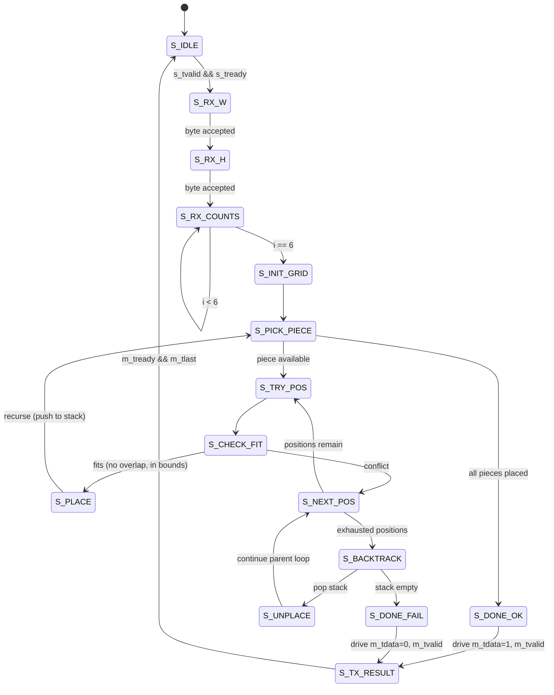
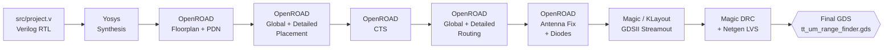
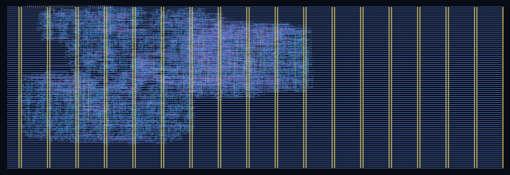

# Day 12 Range Finder — ASIC Backend Physical Design & Verification

[](../../actions) [](../../actions) [](../../actions)

A physical-design / sign-off-verification study built on top of `tt_um_range_finder`,
a Tiny Tapeout (Sky130A) hardware solver for **Advent of Code 2025 — Day 12** (2-D gift packing
via DFS backtracking).

> **Attribution**
> The RTL (`src/project.v`, `tt_um_range_finder` / `Day_12_solver`) is the original work of
> **Robert Solomon Saab** (Discord: `.djharvey`). This repository **does not modify the core
> Verilog logic** — it adds:
>
> 1. A **Python golden reference model** (`day12_golden_model.py`) that mirrors the algorithm
>    and AXI-stream byte protocol of the DUT.
> 2. An **EDA back-end PPA extractor** (`extract_ppa.py`) that distils the OpenLane sign-off
>    metrics into a publishable report.
> 3. **Documentation** of the RTL → GDSII flow, the FSM-level algorithm, and the
>    hardware/software equivalence argument.

---

## 1. Project Scope

| Layer | Responsibility | Owner |
|---|---|---|
| Algorithm / RTL | DFS backtracking solver, AXI-stream I/O | Robert Solomon Saab |
| Backend PnR | Floorplan, CTS, GR, DR, antenna fix, sign-off | OpenLane (Sky130A) |
| Verification (SW) | Python golden model, regression suite | This repo |
| Verification (HW) | cocotb testbench (4x4, 6x6, 8x8, 12x12 cases) | `test/` |
| Reporting | PPA extractor, layout screenshots, README | This repo |

The focus of **this repository** is the right two rows: cross-checking the **silicon-implementable
hardware** against an **independent software model**, and turning the OpenLane log dump into
academically-presentable evidence.

---

## 2. Algorithm — DFS Backtracking on a 2-D Grid

Input is streamed as 8 bytes over an AXI-Stream-like channel:

```
byte[0] = W            ; grid width  (cells)
byte[1] = H            ; grid height (cells)
byte[2..7] = c0..c5    ; how many of gift shape #0 .. #5 to pack
```

Output is a single byte: `1` = solvable, `0` = no packing exists.

### 2.1 FSM-level Backtracking (Mermaid)



The FSM emulates the recursion stack in flip-flops: every place/unplace edits the on-chip grid
register file, and a piece-index pointer plays the role of the recursion depth. The Python golden
model expresses the same control flow as a literal recursive function — the two are
behaviourally identical from the I/O perspective.

### 2.2 EDA Flow — RTL → GDSII (Mermaid)



Each block is logged under `runs/wokwi/<NN>-<tool>-<step>/`. The full ordered list of 70
sign-off steps (lint → STA → DRC → LVS → manufacturability) is preserved in
`runs/wokwi/flow.log` (kept) — bulky intermediate `def/`, `odb/`, `lef/`, `spef/`, `mag/`
artefacts are excluded by `.gitignore`.

---

## 3. Software / Hardware Equivalence

| Aspect | Hardware (`Day_12_solver`) | Software (`day12_golden_model.py`) |
|---|---|---|
| Algorithm | DFS backtracking, FSM-stack | DFS backtracking, Python recursion |
| State | On-chip grid + piece pointer | 2-D list + recursion stack |
| Input format | 8-byte AXI-Stream | `parse_axi_stream([W,H,c0..c5])` |
| Output | 1 byte over `m_tdata` | `solve()` returns `0` / `1` |
| Termination | `m_tlast` high | function returns |

Run the golden model standalone:

```bash
python day12_golden_model.py
```

It prints the AXI byte sequence and the expected DUT output for every regression case —
diff that table against `cocotb` logs from `test/` to confirm equivalence.

---

## 4. Backend PPA — Sign-off Numbers (Sky130A, OpenLane)

Generated from `runs/wokwi/final/metrics.json` by `extract_ppa.py`.
Full table lives in [`ppa_report.md`](ppa_report.md).

| Class | Metric | Value |
|---|---|---|
| Area | Die / Core | 154,113 / 149,183 um² |
| Area | Std-cell area | 41,906 um² |
| Area | Core utilization | **28.09 %** |
| Area | Tile footprint | 4 × 2 (Tiny Tapeout) |
| Cells | Total std cells | **5,896** |
| Cells | Sequential (FF) | 658 |
| Cells | Combinational | 2,106 |
| Cells | Hold-fix buffers | 508 |
| Cells | CTS buffers / inverters | 46 / 25 |
| Cells | Antenna diodes | 21 |
| Routing | Final wirelength | **114,152 um** |
| Routing | Estimated WL (post-GPL) | 94,288 um |
| Routing | Nets / vias | 3,705 / 28,233 |
| Routing | DRC errors | **0** |
| Timing | Setup WS @ TT 25 °C 1.80 V | +11.23 ns |
| Timing | Hold WS @ TT 25 °C 1.80 V | +0.32 ns |
| Timing | Setup WS @ SS 100 °C 1.60 V | +2.33 ns |
| Power | Total @ TT 25 °C | **2.60 mW** |
| Sign-off | Magic DRC / Netgen LVS | PASS / PASS |

Clock target: **10 MHz** (100 ns period). All corners (TT/SS/FF × min/nom/max) close with zero
setup/hold violations after CTS + post-route timing repair.

---

## 5. Physical Layout (KLayout)

Final GDSII rendered from `runs/wokwi/final/klayout_gds/tt_um_range_finder.klayout.gds`:



> Place a dark-mode KLayout screenshot at `docs/klayout_layout.png`. The repo also ships
> `gds_render.png` (a high-res render produced by the Tiny Tapeout flow) — kept at the repo
> root for the project gallery.

---

## 6. Repo Layout

```
.
├── src/
│   └── project.v                  ; RTL (Robert) — DO NOT MODIFY
├── test/                          ; cocotb testbench
│   ├── tb.v / test.py / test_bigger.py
│   └── Makefile
├── runs/wokwi/
│   ├── flow.log / warning.log     ; kept (text logs)
│   ├── resolved.json              ; kept (config snapshot)
│   └── final/
│       ├── metrics.json           ; kept (sign-off PPA)
│       ├── metrics.csv            ; kept
│       ├── gds/                   ; kept (final GDSII only)
│       └── klayout_gds/           ; kept (KLayout-stream variant)
├── docs/
│   ├── info.md                    ; Tiny Tapeout datasheet stub
│   └── klayout_layout.png         ; (user-provided screenshot)
├── day12_golden_model.py          ; Python golden reference
├── extract_ppa.py                 ; PPA log → markdown extractor
├── ppa_report.md                  ; auto-generated sign-off table
├── info.yaml                      ; Tiny Tapeout project descriptor
└── README.md                      ; this file
```

Everything else under `runs/` (intermediate `def/`, `odb/`, `lef/`, `spef/`, `mag/`,
`*.tar.gz` snapshots, Docker caches, `.venv*/`) is **excluded by `.gitignore`** — those
artefacts are reproducible by re-running OpenLane.

---

## 7. Reproducing

```bash
git clone <this-repo>
cd advent_of_fpga_2025_day_12_tiny_tapeout

python day12_golden_model.py

cd test && make

cd ..
python extract_ppa.py
```

Re-running OpenLane (PnR) requires a Sky130A PDK + Docker — see the
[Tiny Tapeout local-hardening guide](https://www.tinytapeout.com/guides/local-hardening/).

---

## 8. License & Credits

* RTL & original Tiny Tapeout submission: © Robert Solomon Saab — see project `LICENSE`.
* Backend reports, golden model, and documentation in this repository: same license.
* PDK: SkyWater 130 nm Open Source PDK (Apache-2.0).
* Flow: OpenLane / OpenROAD / Yosys / Magic / KLayout / Netgen.
